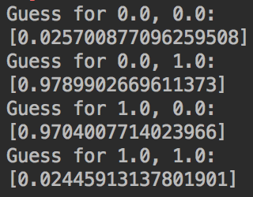

# XOR with Neural Network
This is a very simple example of how the [Basic Neural Network Library](https://github.com/kim-marcel/basic_neural_network) can be used. The library is a Java version of the one built by Daniel Shiffman in [this](https://www.youtube.com/watch?v=XJ7HLz9VYz0&list=PLRqwX-V7Uu6aCibgK1PTWWu9by6XFdCfh) playlist using the [Efficient Java Matrix Library](https://www.ejml.org) (EJML).

The Neural Network (2 inputs, 4 hidden nodes and 1 output) is being trained for 50.000 iterations. After the training is completed the results are printed to the console. That's all what's going to happen. Here's a screenshot:

If you want to see XOR being solved in a visually more appealing way I recommend you checking out this Coding Challenge by Daniel Shiffman:
https://www.youtube.com/watch?v=188B6k_F9jU

If you want to learn more about Neural Networks check out these YouTube-playlists:
- [Neural Networks - The Nature of Code](https://www.youtube.com/watch?v=XJ7HLz9VYz0&list=PLRqwX-V7Uu6aCibgK1PTWWu9by6XFdCfh) by The Coding Train (Daniel Shiffman)
- [Neural Networks](https://www.youtube.com/watch?v=aircAruvnKk&list=PLZHQObOWTQDNU6R1_67000Dx_ZCJB-3pi) by 3Blue1Brown
